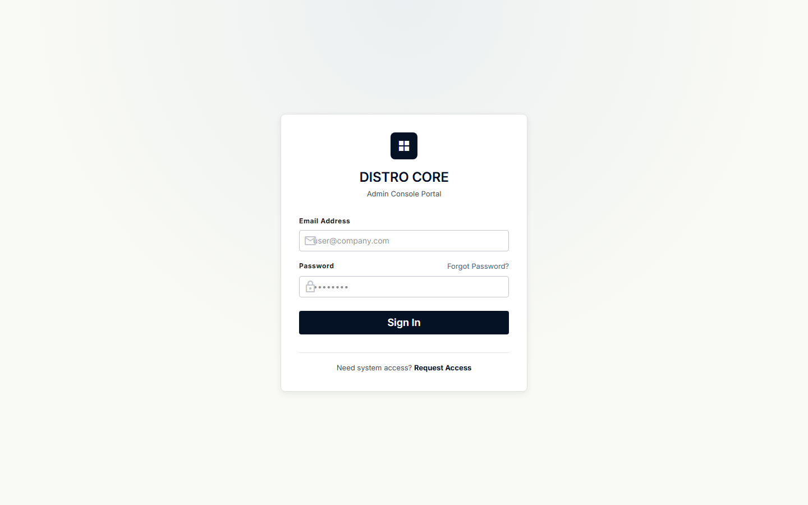
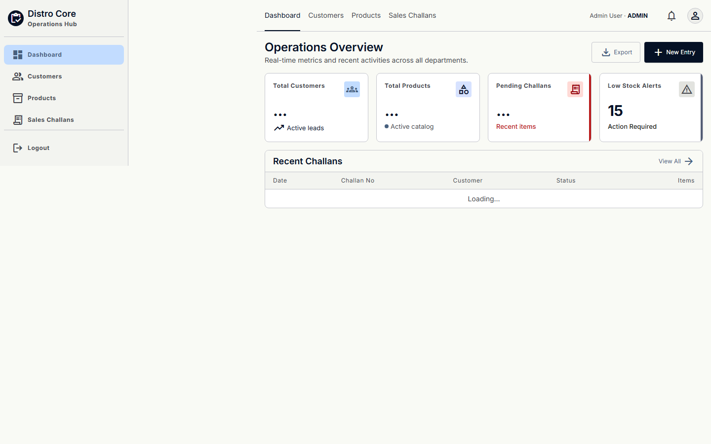
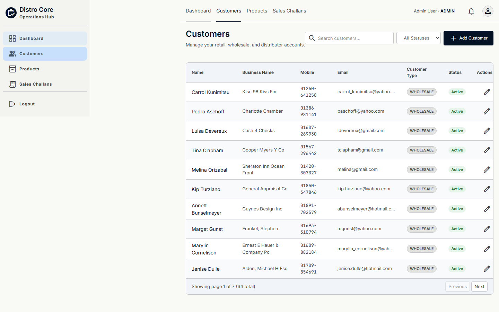
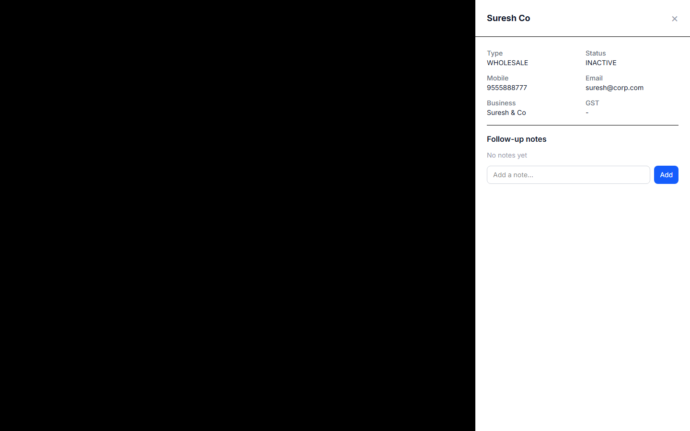
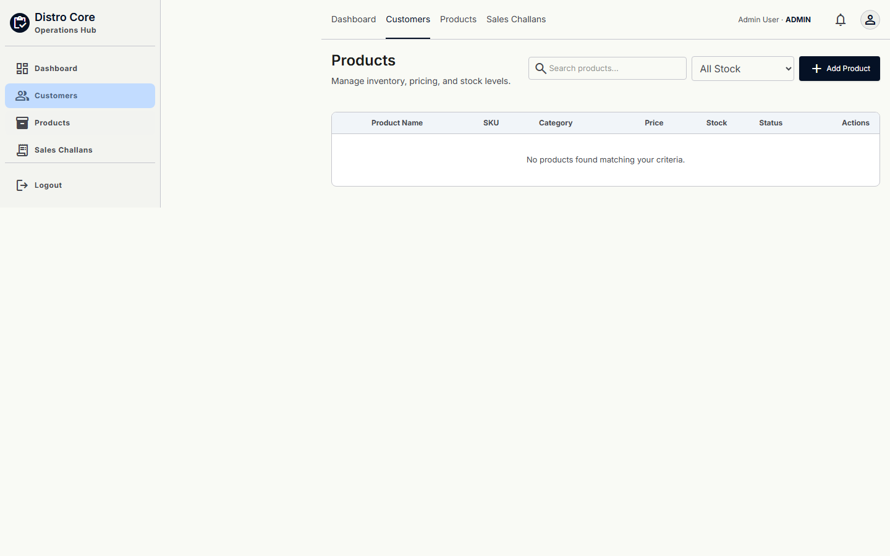
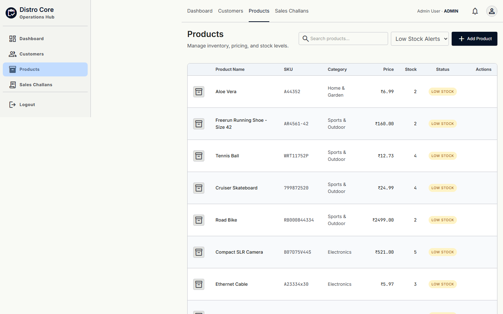
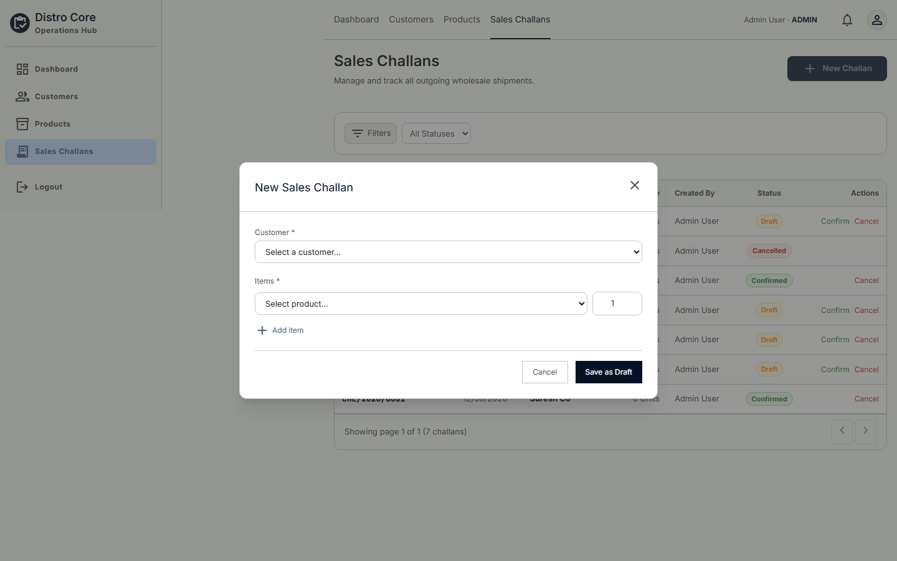
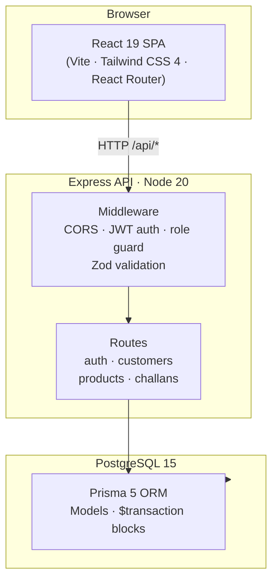

# 📦 Mini ERP + CRM Operations Portal

*This project is a submission for the Fundsroom Infotech Pvt. Ltd. Full Stack Developer case study.*

**A full-stack ERP/CRM for a wholesale/distribution company** — role-based auth, customer CRM, product & inventory management, and a stock-safe sales challan flow, built with Node.js/Express/Prisma and a React/Tailwind frontend.

<p align="center">


</p>

---

## 📑 Table of Contents

- [Screenshots](#-screenshots)
- [Features](#-features)
- [Architecture](#-architecture)
- [Tech Stack](#-tech-stack)
- [Quick Start](#-quick-start)
- [Test Credentials](#-test-credentials)
- [Project Structure](#-project-structure)
- [API Overview](#-api-overview)
- [Security Checklist](#-security-checklist)
- [Deployment](#-deployment)
- [Known Limitations, Postman & Assumptions](#-known-limitations-postman--assumptions)
- [Seed Datasets](#-seed-datasets)

---

## 📸 Screenshots

<table>
  <tr>
    <td width="50%" align="center">
      <br>
      <b>Login</b><br>
      <sub>Role-based sign-in for Admin, Sales, Warehouse & Accounts</sub>
    </td>
    <td width="50%" align="center">
      <br>
      <b>Dashboard</b><br>
      <sub>Customers, products & challans at a glance</sub>
    </td>
  </tr>
  <tr>
    <td width="50%" align="center">
      <br>
      <b>Customers (CRM)</b><br>
      <sub>Search, filter, and manage leads through active accounts</sub>
    </td>
    <td width="50%" align="center">
      <br>
      <b>Customer Detail</b><br>
      <sub>Full profile with an append-only follow-up notes log</sub>
    </td>
  </tr>
  <tr>
    <td width="50%" align="center">
      <br>
      <b>Products & Inventory</b><br>
      <sub>Catalog with stock levels, category, and location</sub>
    </td>
    <td width="50%" align="center">
      <br>
      <b>Low-Stock Alerts</b><br>
      <sub>Filtered view of anything at or below its reorder threshold</sub>
    </td>
  </tr>
  <tr>
    <td width="50%" align="center">
      <br>
      <b>Sales Challans</b><br>
      <sub>Draft, Confirmed and Cancelled challans at a glance</sub>
    </td>
    <td width="50%" align="center">
      <br>
      <b>New Challan</b><br>
      <sub>Multi-product line items with live stock/price awareness</sub>
    </td>
  </tr>
</table>

---

## ✨ Features

### 🔐 Auth & Roles
- JWT-based login, no hardcoded/fallback secret — the server refuses to boot if `JWT_SECRET` isn't set.
- Four roles — **Admin, Sales, Warehouse, Accounts** — enforced route-by-route via a `requireRole` middleware.
- Login endpoint utilizes an in-memory rate-limiter to prevent brute force attacks.

### 👥 Customer CRM
- Full customer record: name, mobile, email, business name, optional GSTIN, customer type (Retail / Wholesale / Distributor), address, status (Lead / Active / Inactive), follow-up date.
- Add, edit, search, and a dedicated detail modal.
- Append-only follow-up notes log per customer.

### 📦 Product & Inventory
- Product catalog: name, SKU, category, unit price, current stock, minimum stock alert, warehouse location.
- Add/edit products; stock adjustments (`IN`/`OUT`) are written through a dedicated endpoint that also logs the movement (quantity, reason, who made it, when).
- Low-stock view filters products at or below their configured threshold.

### 🧾 Sales Challans
- Select a customer, add multiple products with quantities, save as **Draft** or **Confirmed**.
- Challan numbers are generated automatically.
- Confirming a challan is wrapped in a database transaction: stock is checked and deducted atomically, and it's rejected with a proper error if stock is insufficient — it cannot go negative.
- Snapshot data tracking simplified down to tracking totals alongside relational ids.

---

## 🏗️ Architecture



The one piece of business logic worth calling out: confirming (or creating a pre-confirmed) challan runs inside a Prisma `$transaction` — it re-checks current stock, deducts it, and persists the challan in one atomic step, so concurrent confirmations can't race each other into negative stock.

---

## 🧰 Tech Stack

| Layer      | Technology                                              |
| ---------- | --------------------------------------------------------- |
| Frontend   | React 19, Vite, React Router, Tailwind CSS 4             |
| Backend    | Node.js 20, Express, TypeScript                          |
| Database   | PostgreSQL 15 + Prisma 5 ORM                                |
| Auth       | JWT (jsonwebtoken), bcryptjs password hashing               |
| Validation | Zod                                                          |
| Containers | Docker Compose (PostgreSQL), standalone backend `Dockerfile` |

---

## 🚀 Quick Start

### Option A — Docker for the database, npm for the app (recommended)

`docker-compose.yml` brings up PostgreSQL only; the backend and frontend still run with `npm`.

```bash
docker compose up -d          # starts Postgres on :5432

cd backend
cp .env.example .env          # defaults already match docker-compose.yml
npm install
npx prisma generate
npx prisma db push
npm run prisma:seed           # creates the 4 test users + imports seed data
npm run build
npm start                     # API on :4000

# in a second terminal
cd frontend
npm install
npm run dev                   # app on :5173
```

### Option B — Fully manual

Point `DATABASE_URL` in `backend/.env` at any PostgreSQL 15 instance you already have running, then follow the same backend/frontend steps as above (skip `docker compose up`).

Open **http://localhost:5173** once both are running.

---

## 🔑 Test Credentials

The database seed provides 4 default users, one for each role:

| Role          | Email                   | Password      |
| :------------ | :----------------------- | :-------------- |
| **Admin**     | `admin@erp.com`          | `password123`   |
| **Sales**     | `sales@erp.com`          | `password123`   |
| **Warehouse** | `warehouse@erp.com`      | `password123`   |
| **Accounts**  | `accounts@erp.com`       | `password123`   |

---

## 📂 Project Structure

```text
mini-erp-crm/
├── backend/                  # Node.js + Express + TypeScript API
│   ├── prisma/               # schema.prisma + seed.ts
│   ├── src/
│   │   ├── middleware/       # JWT auth, role guard, Zod validation
│   │   ├── routes/           # auth, customers, products, challans
│   │   └── utils/            # db connection, error handling
│   ├── .env.example
│   └── Dockerfile
├── frontend/                 # React + Vite + Tailwind SPA
│   ├── src/
│   │   ├── components/       # Layout, shared UI
│   │   ├── context/          # AuthContext
│   │   ├── pages/            # Login, Dashboard, Customers, Products, Challans
│   │   └── index.css         # Tailwind tokens
│   └── .env.example
├── scripts/                  # Playwright screenshot generator
├── screenshots/              # Generated UI screenshots (this README)
├── docker-compose.yml        # PostgreSQL for local dev
├── LIMITATIONS.md            # Honest gap analysis vs. the case study PDF
├── AUDIT_FINAL.md            # Requirement-by-requirement audit
├── postman_collection.json   # Postman collection covering every route
└── README.md                 # This file
```

---

## 🔌 API Overview

All endpoints are prefixed with `/api` and (except login) require `Authorization: Bearer <token>`. A full request/response reference is in [`postman_collection.json`](./postman_collection.json).

| Method | Endpoint                    | Roles allowed              | Description                          |
| ------ | ---------------------------- | --------------------------- | -------------------------------------- |
| POST   | `/api/auth/login`             | —                            | Login, rate-limited                     |
| GET    | `/api/customers`               | Admin, Sales, Accounts       | List/search customers, paginated        |
| POST   | `/api/customers`                 | Admin, Sales                  | Create customer                          |
| GET    | `/api/customers/:id`               | Admin, Sales, Accounts          | Customer detail                            |
| PUT    | `/api/customers/:id`                 | Admin, Sales                      | Update customer                              |
| POST   | `/api/customers/:id/notes`             | Any authenticated user              | Add a follow-up note                           |
| GET    | `/api/products`                          | Any authenticated user                | List/search products, paginated, low-stock filter |
| POST   | `/api/products`                            | Admin, Warehouse                        | Create product                                      |
| PUT    | `/api/products/:id`                          | Admin, Warehouse                          | Update product                                        |
| POST   | `/api/products/:id/stock`                      | Admin, Warehouse                            | Adjust stock (IN/OUT), logs the movement                |
| GET    | `/api/products/:id/movements`                    | Any authenticated user                        | Stock movement history for a product                      |
| GET    | `/api/challans`                                    | Any authenticated user                          | List/search challans, paginated                              |
| POST   | `/api/challans`                                      | Admin, Sales                                      | Create a challan (Draft or Confirmed)                           |
| GET    | `/api/challans/:id`                                    | Any authenticated user                              | Challan detail                                                    |
| PUT    | `/api/challans/:id`                                      | Admin, Sales                                          | Edit a Draft challan                                                |
| POST   | `/api/challans/:id/confirm`                                | Admin, Sales                                            | Confirm a Draft — deducts stock atomically                            |
| POST   | `/api/challans/:id/cancel`                                   | Admin, Sales                                              | Cancel a challan                                                         |

---

## 🔐 Security Checklist

| Item                                                    | Status         |
| --------------------------------------------------------- | ---------------- |
| JWT authentication, no hardcoded fallback secret            | ✅               |
| bcryptjs password hashing                                     | ✅               |
| Rate limiting on `/api/auth/login`                               | ✅               |
| Role-based access control on every mutating route                  | ✅               |
| Zod request validation                                                | ✅               |
| CORS restricted via setup                                        | ✅               |
| HTTPS (via a reverse proxy — Render/Railway/Vercel provide this)              | ⚠️ configure on deploy |
| Database backups                                                                | ⚠️ configure on deploy |

---

## 🚢 Deployment

### Environment Variables (required in production)

| Variable       | Where            | Required | Description                                  |
| -------------- | ------------------ | ---------- | ----------------------------------------------- |
| `PORT`           | backend             | Optional     | Default: `4000`                                   |
| `DATABASE_URL`     | backend               | ✅ Yes         | PostgreSQL connection string                        |
| `JWT_SECRET`         | backend                 | ✅ Yes           | Long random string — server won't start without it   |
| `VITE_API_URL`         | frontend                  | ✅ Yes             | Backend API base URL, e.g. `https://your-api/api`       |

**Suggested free-tier platforms** (matching the case study's guidance): database on Neon/Supabase, backend on Render/Railway, frontend on Vercel/Netlify.

---

## 📋 Known Limitations, Postman & Assumptions

- **Full, honest gap analysis**: see [`LIMITATIONS.md`](./LIMITATIONS.md) — it covers every item in the PDF's Submission Requirements and Bonus Points sections, including what wasn't attempted (AWS deployment, a live-hosted URL, invoice-as-PDF export, S3 image upload).
- **Postman collection**: [`postman_collection.json`](./postman_collection.json) covers every route above, with the four role logins set up as collection variables so you can switch roles without re-typing tokens.
- **Requirement-by-requirement audit**: [`AUDIT_FINAL.md`](./AUDIT_FINAL.md) walks the PDF checklist item by item against the current code.

---

## 🌱 Seed Datasets

The seed script pulls real, schema-valid public data instead of a handful of placeholder rows:
- **Customers**: UK Businesses dataset from [chandanverma07/DataSets](https://github.com/chandanverma07/DataSets/blob/master/Data_Uk.csv) (public use).
- **Products**: Mock eCommerce products from [Vendure's mock data](https://github.com/vendure-ecommerce/vendure/blob/master/packages/core/mock-data/data-sources/products.csv) (MIT License).

The 4 fixed test-login users above are always created regardless of what the external datasets return.
